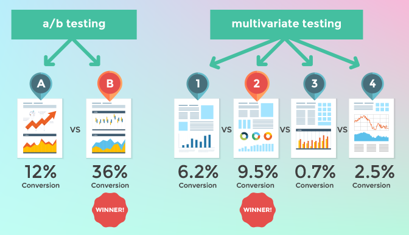

<h1 align="center">
  <a href="https://github.com/snow01/ab-optimisation-framework">
    <!-- Please provide path to your logo here -->
    
  </a>
</h1>

<div align="center">
  <b>AB Optimisation Framework</b>
  <br />
  <a href="#about"><strong>Explore the screenshots »</strong></a>
  <br />
  <br />
  <a href="https://github.com/snow01/ab-optimisation-framework/issues/new?assignees=&labels=bug&template=01_BUG_REPORT.md&title=bug%3A+">Report a Bug</a>
  ·
  <a href="https://github.com/snow01/ab-optimisation-framework/issues/new?assignees=&labels=enhancement&template=02_FEATURE_REQUEST.md&title=feat%3A+">Request a Feature</a>
  ·
  <a href="https://github.com/snow01/ab-optimisation-framework/discussions">Ask a Question</a>
</div>

<div align="center">
<br />

[](LICENSE)

[](https://github.com/snow01/ab-optimisation-framework/issues?q=is%3Aissue+is%3Aopen+label%3A%22help+wanted%22)
[](https://github.com/snow01)

</div>

<details open="open">
<summary>Table of Contents</summary>

- [About](#about)
    - [Built With](#built-with)
- [Getting Started](#getting-started)
    - [Prerequisites](#prerequisites)
    - [Installation](#installation)
- [Usage](#usage)
- [Roadmap](#roadmap)
- [Support](#support)
- [Project assistance](#project-assistance)
- [Contributing](#contributing)
- [Authors & contributors](#authors--contributors)
- [Security](#security)
- [License](#license)
- [Acknowledgements](#acknowledgements)

</details>

---

## About

Multi Arm Bandit based AB Experimentation and Feature Rollout optimisation framework.

<br/>
<details>
<summary>Screenshots</summary>

|                               Home Page                               |                               Login Page                               |
| :-------------------------------------------------------------------: | :--------------------------------------------------------------------: |
|  |  |

</details>

### Built With

- Service -- Rust v1.53.0
- Admin UI -- streamlit

## Getting Started

### Prerequisites

- Rust v1.53.0

### Installation

#### Service
```shell
cd service
cargo build
./target/debug/ab-optimisation-framework start --config_dir=config --env=dev
```

#### Admin UI

> TODO

## Usage

### APIs

#### /api/run-experiment

Finds all the active experiments for a given project, user, and custom context.

Method = `POST`

Request =
```json
{
  "app_id": "id of the app",
  "project_id": "id of the project",
  "user_id": "string user id",
  "ctx": "custom json object"
}
```

Response =
```json
{
  "data": {
    "project_id": "id of the project",
    "active_experiments": [
      {
        "experiment": "name of the experiment",
        "kind": "experiment",
        "variation": "variation, if any",
        "data": "stored json object, if any, that caller can use to configure its logic"
      },
      {
        "experiment": "name of the experiment",
        "kind": "feature",
        "data": "stored json object, if any, that caller can use to configure its logic"
      }
    ]
  },
  "time_taken": "human readable time taken by server"
}
```

#### other admin APIs

> TODO
 
#### /oor

Inverts the OOR status of the service and returns new status

Method = `GET`

Response = `one of the string: OK, NOK`

#### /status

Returns the rotation status of the service

Method = `GET`

Response = `one of the string: OK, NOK`

## Design Details

- AB Experimentation configurations are defined for an App, known by a name.
- Each app has one or more projects, known by a name.
- Each project has one or many experiments, each having a name, target audience, and experiment size. Target audience can be defined as an expression on cookie, header, or custom context.
- Each experiment has one or many variations, each having variation size and a stored configuration that can be used for configuring test behaviour in the application.
- Feature is a specific type of experiment with no variations.
- Each project can have one or many experiment groups, which defines a mutual exclusion policy between experiments, and priority of experiments. An experiment can be part of only one experiment group.
- Target audiences can also be a predefined list of users for the environment - such as beta.


## Roadmap

- SDKs for 
  - Java Server
  - iOS App
  - Android App
  - Web App

See the [open issues](https://github.com/snow01/ab-optimisation-framework/issues) for a list of proposed features (and
known issues).

- [Top Feature Requests](https://github.com/snow01/ab-optimisation-framework/issues?q=label%3Aenhancement+is%3Aopen+sort%3Areactions-%2B1-desc) (
  Add your votes using the 👍 reaction)
- [Top Bugs](https://github.com/snow01/ab-optimisation-framework/issues?q=is%3Aissue+is%3Aopen+label%3Abug+sort%3Areactions-%2B1-desc) (
  Add your votes using the 👍 reaction)
- [Newest Bugs](https://github.com/snow01/ab-optimisation-framework/issues?q=is%3Aopen+is%3Aissue+label%3Abug)

## Support

Reach out to the maintainer at one of the following places:

- [GitHub discussions](https://github.com/snow01/ab-optimisation-framework/discussions)
- [Shailendra Sharma](https://github.com/snow01)

## Project assistance

If you want to say **thank you** or/and support active development of AB Optimisation Framework:

- Add a [GitHub Star](https://github.com/snow01/ab-optimisation-framework) to the project.
- Tweet about the AB Optimisation Framework on your Twitter.
- Write interesting articles about the project on [Dev.to](https://dev.to/), [Medium](https://medium.com/) or personal
  blog.

Together, we can make AB Optimisation Framework **better**!

## Contributing

First off, thanks for taking the time to contribute! Contributions are what make the open-source community such an
amazing place to learn, inspire, and create. Any contributions you make will benefit everybody else and are **greatly
appreciated**.

We have set up a separate document containing our [contribution guidelines](docs/CONTRIBUTING.md).

Thank you for being involved!

## Authors & contributors

The original setup of this repository is by [Shailendra Sharma](https://github.com/snow01).

For a full list of all authors and contributors,
check [the contributor's page](https://github.com/snow01/ab-optimisation-framework/contributors).

## Security

AB Optimisation Framework follows good practices of security, but 100% security can't be granted in software. AB
Optimisation Framework is provided **"as is"** without any **warranty**. Use at your own risk.

_For more info, please refer to the [security](docs/SECURITY.md)._

## License

This project is licensed under the **MIT license**.

See [LICENSE](LICENSE) for more information.

## Acknowledgements

> TODO